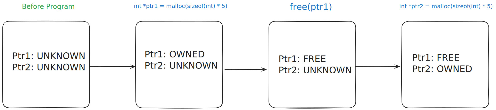

# MemCheck

MemCheck is a tool for intraprocedural heap allocated memory checking. It can check for the following properties:

- Memory leaks (unfreed memory)
- Double frees
- Use after free

## How it Operates

MemCheck works by traversing the AST and keeping track of where `(c|m)alloc`, and `free` are called. When memory is allocated it *must* be associated with a variable, this is to prevent any allocations from immediately loosing a handle to heap allocated memory. Variables which have memory allocated to them are marked with one of three states. `OWNED` - indicates the variable owns some heap memory. `FREE` - indicates the variable previously held some heap allocated memory. `UNKNOWN` - indicates the variable is in some unknown state.

`malloc` and `calloc` simply check if the call was made within the scope of a variable and change its state to `OWNED`. `free` checks to see if the variable its trying to free is a pointer into heap memory and frees it if the variable is marked as `OWNED` or throws an error if the memory its trying to free is already `FREE` or `UNKNOWN`. `realloc` is a little different as it checks to see if you've reallocated to the same variable. This is to *prevent leaking memory if reallocate fails* which forces programmers to use a temp or some other measure to realloc and not loose track of the previous pointer in the case of a failure. `realloc` also checks to see if the variable its allocating to already points to memory in the heap.

MemCheck also looks for assignments to variables which hold pointers to heap memory. If a value in the heap is modified after its been freed (use after free) MemCheck will throw an error. It will also prevent the variable being reassigned a value when it is still pointing into heap memory.

Because MemCheck is intraprocedural, it also checks return values for variables which point into heap memory. It will prevent any variable that has been used to point into memory from returning. This includes memory which has been freed as even if the memory is free, if the variable has not been set to **NULL** there is still a handle into heap memory.

Unfortunately MemCheck does not entirely account for aliasing as of right now. I spent a majority of my time setting up the ASTVisitor and the proper clang and llvm libraries and had little time to come up with a full implementation. However it would be fairly straightforward to extend MemCheck to use a set of variables which map to pointers states in memory. As a temporary sort of measure MemCheck will prevent aliases of variables which point into heap memory.

## Example 

```c
int main() {
    int *ptr1 = malloc(sizeof(int) * 5);
    free(ptr1);

    int *ptr2 = malloc(sizeof(int) * 5);
}
```

As a simple example here, MemCheck will traverse the AST and find that malloc has been called and assigned to `ptr1`. `ptr1` will then be marked as `OWNED` to indicate that a pointer to heap memory is allocated to it. The traversal will continue and in the next line MemCheck will find the `free` and check its argument to find `ptr1` and subsequently mark `ptr1` as `FREE`. Similar to `ptr1`, `ptr2` will also be marked as `OWNED` on the malloc. However when the traversal finishes, `ptr2` is still allocated which causes a memory leak.

> 
> Diagram of memory state as traversal progresses

## Details/Insights/Challenges

The checking logic mostly consists of looking for patterns of good programming and altering the statemap based on those patterns. While this is fairly basic and somewhat restictive by nature, it is by design. Partly because I only had a short amount of time to implement the checker, and partly because heavier restrictions on how memory is allocated leads to better memory saftey. Only allowing for specific patterns to emerge helps ensure the patterns that do emerge are safe and will not leak memory. This is observed in my code with plenty of checks, error messages, and returns where invalid states or unexpected nodes are encountered. The most complicated part of this whole project was really just figuring out how clang and its AST work. It took a while to get the clang and llvm libraries set up, and then my development environment and a skeleton file to start parsing through the AST. Even when I had all that it took a lot of digging through docs and examles to figure out how to extract the nodes and properties I wanted from the AST. For the future I would this tool to be a little more expansive, specifically supporting aliasing and interprocedural checking.

## Testing

The results of the test suite can be viewed with `./build.sh test` and are as follows:

```
[100%] Built target memory-analyzer

=== Testing on ../tests/alias.c ===
../tests/alias.c:6:3: error: Tried to alias pointer into heap memory
error: There is potentially unfreed memory

=== Testing on ../tests/double_free.c ===
../tests/double_free.c:6:5: error: Double free of memory

=== Testing on ../tests/leak.c ===
error: There is potentially unfreed memory

=== Testing on ../tests/okay.c ===
Memory okay!

=== Testing on ../tests/overwrite_mem.c ===
../tests/overwrite_mem.c:6:3: error: Variable being assigned to has not freed its memory
error: There is potentially unfreed memory

=== Testing on ../tests/reallocate.c ===
../tests/reallocate.c:16:3: error: Variable being assigned to has not freed its memory
error: There is potentially unfreed memory

=== Testing on ../tests/ret_ptr.c ===
../tests/ret_ptr.c:5:3: error: Attempted to return pointer to heap memory
../tests/ret_ptr.c:11:3: error: Attempted to return freed pointer to heap memory
error: There is potentially unfreed memory

=== Testing on ../tests/use_after_free_deref.c ===
../tests/use_after_free_deref.c:6:3: error: Tried to deref freed memory

=== Testing on ../tests/use_after_free_index.c ===
../tests/use_after_free_index.c:6:3: error: Tried to index into freed memory
```

The test suite covers the specific cases the memory checker is is meant to analyze and a valid case where no memory is leaked.

# Running

This requires the following tools and libraries to be installed:

- cmake
- make
- clang (library and compiler)
- llvm (library)

The project can then be build and tested with:

```sh
# NOTE: You may have to change CLANG_VERSION in the script (21 by default)
./build.sh

# Or to build and test
./build.sh test
```
> [!WARNING]
> The build script *should* work on MacOS if `llvm` and `clang` are installed with *homebrew*.
> 
> If not the `build.sh` script may have to be modified. You should only have to change the `cmake` command arguments where any **NOTE:** is found.

## Manual Install

If the `build.sh` file does not work the following steps can be performed.

```sh
mkdir build
cd build

# NOTE: If this command fails to find Clang and/or LLVM set -DLLVM_DIR=... and -DClang_DIR=...
cmake ..

make

./memory-analyzer <path-to-file.c> -- -I<path-to-clang-lib>/<clang-version>/include
```

